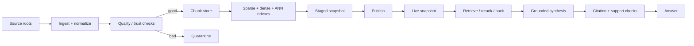
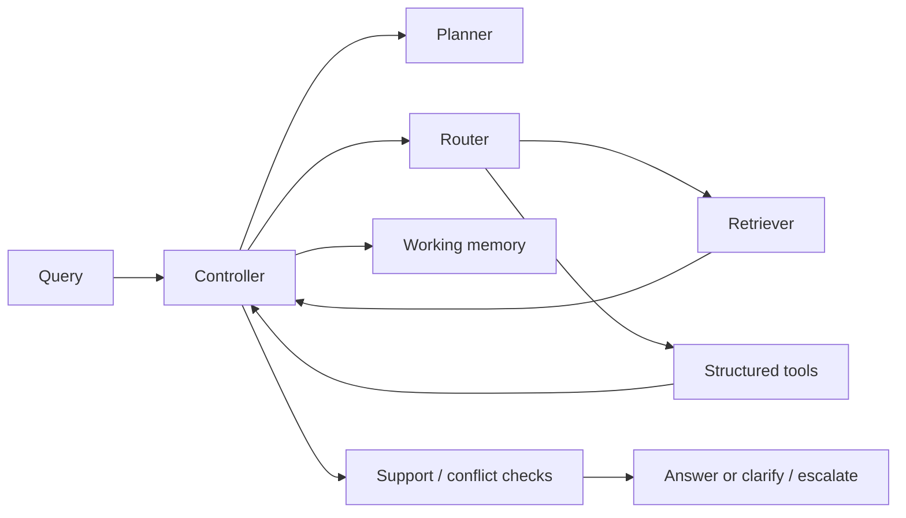

# Architecture

`rag-systems-lab` is a small but production-shaped teaching system that mirrors the textbook's main distinction between **offline knowledge preparation** and **online evidence use**. The package keeps retrieval, generation, tools, state, evaluation, and operations separate so learners can trace failures to the right layer.

## Major modules

- `raglab/ingest/pipeline.py`  
  Offline ingestion: parse source files, normalize metadata, detect low-quality or suspicious inputs, quarantine bad files, and emit chunk records.

- `raglab/build.py` and `raglab/retrieval/indexes.py`  
  Index construction: build sparse BM25-style, dense hashed-vector, and approximate LSH indexes inside a staged snapshot.

- `raglab/retrieval/engine.py`  
  Query understanding, metadata filtering, first-pass retrieval, reranking, conflict detection, and context packing.

- `raglab/generation/*`  
  A closed-book baseline, grounded extractive synthesis, and claim-level citation verification.

- `raglab/agent/*`  
  Stateful controller, routing, planning, tool schemas, memory, and a small multi-agent specialization path.

- `raglab/evaluation/*`  
  Retrieval metrics, groundedness metrics, clarification metrics, and a benchmark runner.

- `raglab/ops/*`  
  Snapshot publishing, traces, cache hooks, trust checks, and governance policies.

## Offline and online data flow

The offline path writes immutable snapshot artifacts. The online path reads only from a chosen snapshot so the serving system can be traced back to a specific knowledge-base version.

## How the CLI maps to services

- `ingest` -> `raglab.ingest.pipeline.ingest_corpus`
- `index` -> `raglab.build.index_staged_snapshot`
- `publish` -> `raglab.ops.publish.publish_staged_snapshot`
- `retrieve` -> `KnowledgeBase.retrieve`
- `answer` -> `KnowledgeBase.retrieve` + `synthesize_answer`
- `agent` -> `run_agent`
- `evaluate` -> `run_benchmark`
- `trace` -> `load_trace` + `trace_summary`
- `demo` -> `raglab.demos`

## Agentic control loop

The controller is intentionally bounded. It can retrieve, follow references, call tools, ask for clarification, revise route choice, or stop. It cannot spin forever without hitting a budget cap.

## Why the structure resembles a real system

Even though the repository is small and dependency-light, it keeps the same seams a larger deployment needs:

- separate offline and online planes
- explicit chunk store and index artifacts
- role-aware retrieval filters
- traceable controller actions
- publishable snapshots
- quarantined bad inputs
- evaluation that separates retrieval from answer quality

## Intentionally simplified pieces

- dense retrieval uses hashed vectors instead of neural embeddings
- ANN uses LSH instead of HNSW / IVF / PQ
- generation is extractive rather than LLM-backed
- structured tools read local JSON instead of SQL or APIs
- governance is role/disclosure-based rather than enterprise IAM

These simplifications are deliberate. They keep the system readable while preserving the textbook's system-level ideas.
