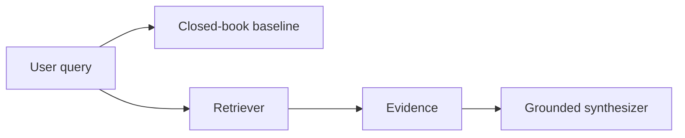

# Chapter 1: What large language models know and forget

## Chapter concepts covered

- **Parametric vs explicit evidence** (documented only)
- **Prompt-sensitive recall and staleness risk** (partially demonstrated)
- **Need for provenance on local facts** (implemented in code)

## What is implemented directly vs documented only

- **Parametric vs explicit evidence** - documented only. Explained and contrasted via the closed-book baseline; there is no real LLM parameter store.
- **Prompt-sensitive recall and staleness risk** - partially demonstrated. Demonstrated by the inability of closed-book mode to answer source-sensitive corpus questions.

## Code paths

- `raglab/generation/closed_book.py`
- `raglab/generation/synthesizer.py`
- `raglab/generation/verify.py`

## Mermaid diagram



## CLI commands to run

```bash
poetry run raglab demo prepare --workspace .workspace/demo
```
```bash
poetry run raglab answer "Does firmware 3.2 change the V14 installation torque, and where is that stated?" --workspace .workspace/demo --user-id field-eu --mode closed_book
```
```bash
poetry run raglab answer "Does firmware 3.2 change the V14 installation torque, and where is that stated?" --workspace .workspace/demo --user-id field-eu
```

## Debugging tips

- Compare closed-book output to grounded output; the former intentionally lacks evidence and citations.
- Inspect the trace from the grounded path to see retrieved evidence before synthesis.

## Trace and log outputs to inspect

- workspace/traces/*.json generated by `answer` or `demo`

## Tests that cover this chapter

- `tests/test_integration.py::AnswerAndAgentTests.test_grounded_answer_includes_supported_claim`

## What to read first in code

- `raglab/generation/closed_book.py`
- `raglab/generation/synthesizer.py`

## Limitations / simplifications

The repository cannot implement a real LLM's parametric memory. It demonstrates the distinction by contrasting a tiny closed-book baseline with evidence-grounded synthesis.
