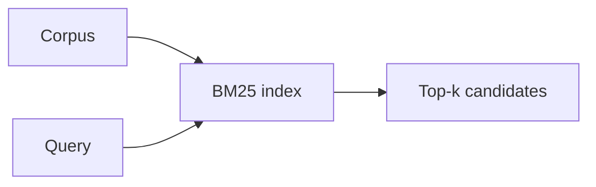

# Chapter 4: The core architecture of basic RAG

## Chapter concepts covered

- **Retriever, reranker, generator, knowledge base boundaries** (implemented in code)
- **Non-agentic fixed workflow** (implemented in code)
- **Offline vs online path distinction** (implemented in code)

## What is implemented directly vs documented only

- None. This chapter is represented directly in code.

## Code paths

- `raglab/retrieval/indexes.py`
- `raglab/retrieval/engine.py`
- `raglab/evaluation/metrics.py`

## Mermaid diagram



## CLI commands to run

```bash
poetry run raglab retrieve "Which bulletin changed the torque for V14 and mentions SB-118?" --workspace .workspace/demo --user-id field-eu --route sparse
```
```bash
poetry run raglab demo chapter 3 --workspace .workspace/demo --run
```

## Debugging tips

- Inspect score ordering and reasons in `retrieve` output.
- Compare sparse and dense routes on the same query to see lexical vs semantic behavior.

## Trace and log outputs to inspect

- `retrieve` output and optional traces via `answer`/`agent`

## Tests that cover this chapter

- `tests/test_integration.py::RetrievalTests.test_sparse_retrieval_finds_exact_identifier`

## What to read first in code

- `raglab/retrieval/indexes.py`
- `raglab/retrieval/engine.py`

## Limitations / simplifications

The sparse index is small and file-based. It demonstrates BM25-style ranking, not web-scale inverted-index engineering.
