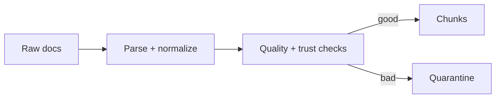

# Chapter 6: Documents, corpora, and chunking

## Chapter concepts covered

- **Front matter parsing and normalization** (implemented in code)
- **Layout-aware and table-aware chunking** (implemented in code)
- **OCR noise, duplicates, quarantine workflow** (partially demonstrated)

## What is implemented directly vs documented only

- **OCR noise, duplicates, quarantine workflow** - partially demonstrated. Low-OCR and malicious documents are quarantined; PDF OCR is simulated.

## Code paths

- `raglab/ingest/pipeline.py`
- `raglab/ops/security.py`

## Mermaid diagram



## CLI commands to run

```bash
poetry run raglab ingest --source examples/corpus/base --source examples/corpus/update --workspace .workspace/demo
```
```bash
poetry run python - <<'PY'
from pathlib import Path
print((Path('.workspace/demo')/'staged'/'quarantine.jsonl').read_text())
PY
```

## Debugging tips

- Inspect `staged/quarantine.jsonl` to see why malicious and low-OCR files were excluded.
- Inspect `staged/chunks.jsonl` for row-level table chunks and duplicate hints in metadata.

## Trace and log outputs to inspect

- Offline artifacts in `workspace/staged/*`

## Tests that cover this chapter

- `tests/test_integration.py::IngestionTests.test_quarantine_contains_malicious_and_low_quality_docs`
- `tests/test_integration.py::IngestionTests.test_table_row_chunk_exists_for_sb118`

## What to read first in code

- `raglab/ingest/pipeline.py`
- `raglab/ops/security.py`

## Limitations / simplifications

Parsing is limited to markdown, text, and CSV. PDF/OCR handling is simulated through front matter and noisy text examples.
