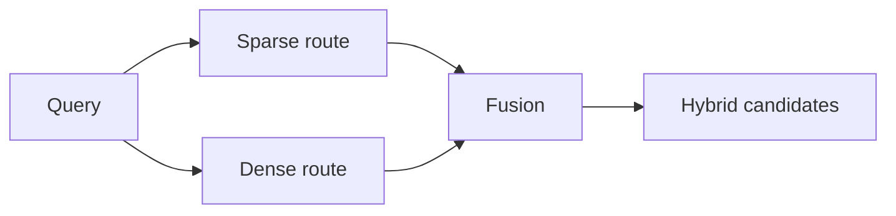

# Chapter 7: Embeddings and vector representations

## Chapter concepts covered

- **Vector representations and cosine similarity** (implemented in code)
- **Dual-encoder style offline chunk vectors / online query vectors** (partially demonstrated)
- **Representation drift and domain mismatch** (documented only)

## What is implemented directly vs documented only

- **Dual-encoder style offline chunk vectors / online query vectors** - partially demonstrated. The hash vectorizer plays the role of a stand-in encoder.
- **Representation drift and domain mismatch** - documented only. Discussed honestly; not benchmarked against alternate embedding models.

## Code paths

- `raglab/retrieval/indexes.py`
- `raglab/retrieval/engine.py`

## Mermaid diagram



## CLI commands to run

```bash
poetry run raglab retrieve "What changed in tightening requirements after the 3.2 update for V14?" --workspace .workspace/demo --user-id field-eu --route dense
```
```bash
poetry run raglab retrieve "Which bulletin changed the torque for V14 and mentions SB-118?" --workspace .workspace/demo --user-id field-eu --route sparse
```
```bash
poetry run raglab demo chapter 14 --workspace .workspace/demo --run
```

## Debugging tips

- Use the same query with `--route sparse`, `--route dense`, and `--route hybrid` to compare top hits.
- Toggle `--no-ann` to compare exact dense search against the approximate LSH candidate set.

## Trace and log outputs to inspect

- `retrieve` output; compare dense vs sparse hit lists directly

## Tests that cover this chapter

- `tests/test_integration.py::RetrievalTests.test_dense_retrieval_handles_paraphrase`
- `tests/test_integration.py::RetrievalTests.test_sparse_retrieval_finds_exact_identifier`

## What to read first in code

- `raglab/retrieval/indexes.py`
- `raglab/retrieval/engine.py`

## Limitations / simplifications

Dense retrieval uses deterministic hashing vectors and ANN uses LSH. The code demonstrates geometric search and approximation, not neural encoders or HNSW/IVF/PQ.
