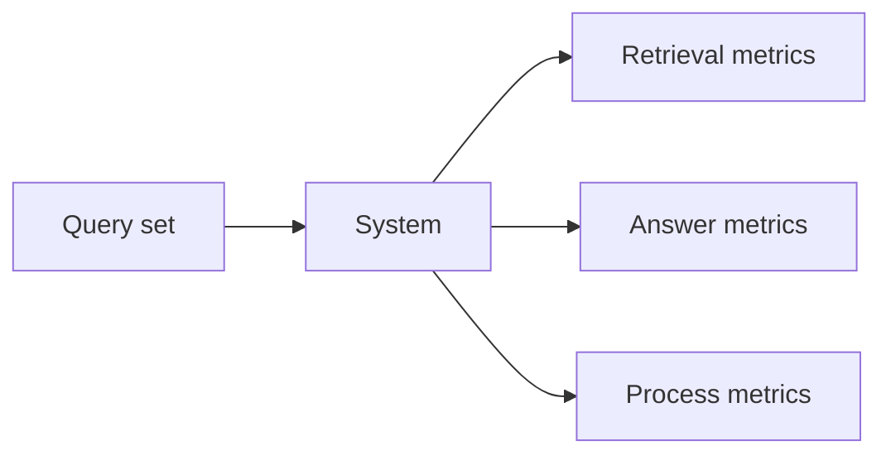

# Chapter 13: Evaluating basic RAG systems

## Chapter concepts covered

- **Retrieval metrics** (implemented in code)
- **Groundedness and task-level answer metrics** (implemented in code)
- **Dirty corpora and false negatives in evaluation** (partially demonstrated)

## What is implemented directly vs documented only

- **Dirty corpora and false negatives in evaluation** - partially demonstrated. The benchmark corpus includes noisy and quarantined inputs, but label incompleteness is only lightly simulated.

## Code paths

- `raglab/evaluation/metrics.py`
- `raglab/evaluation/runner.py`
- `raglab/ops/tracing.py`

## Mermaid diagram



## CLI commands to run

```bash
poetry run raglab evaluate --workspace .workspace/demo --mode answer
```
```bash
poetry run raglab evaluate --workspace .workspace/demo --mode agent
```

## Debugging tips

- Inspect `examples/eval/queries.jsonl` to see the benchmark structure and expected fragments.
- Compare per-query retrieval metrics to answer groundedness to diagnose stage-specific failure.

## Trace and log outputs to inspect

- Evaluation output plus any trace files generated by sampled agent runs

## Tests that cover this chapter

- `tests/test_integration.py::OpsAndCliTests.test_benchmark_runner_returns_metrics`

## What to read first in code

- `raglab/evaluation/runner.py`
- `raglab/evaluation/metrics.py`

## Limitations / simplifications

Metrics are deliberately lightweight and use small bundled labels. They demonstrate stage-wise evaluation, not industrial-scale annotation pipelines.
