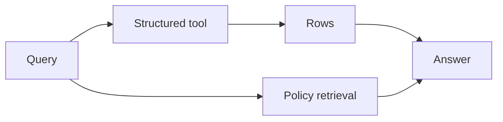

# Chapter 15: Metadata filtering and structured retrieval

## Chapter concepts covered

- **Hard metadata filters** (implemented in code)
- **Permission-aware retrieval** (implemented in code)
- **Structured retrieval over records** (implemented in code)

## What is implemented directly vs documented only

- None. This chapter is represented directly in code.

## Code paths

- `raglab/agent/tools.py`
- `raglab/agent/controller.py`
- `raglab/retrieval/engine.py`

## Mermaid diagram



## CLI commands to run

```bash
poetry run raglab agent "Which EU service centers support V14 sensor replacement under the current warranty program?" --workspace .workspace/demo --user-id distributor-eu --assume region=EU --assume product=V14
```
```bash
poetry run raglab demo chapter 15 --workspace .workspace/demo --run
```

## Debugging tips

- Inspect the `lookup_service_centers` tool schema and its normalized output.
- Compare the structured lookup result to the follow-on policy retrieval in the controller trace.

## Trace and log outputs to inspect

- Agent traces with `tool_lookup_service_centers` span

## Tests that cover this chapter

- `tests/test_integration.py::AnswerAndAgentTests.test_agent_can_use_structured_tool`

## What to read first in code

- `raglab/agent/tools.py`
- `raglab/agent/controller.py`

## Limitations / simplifications

Structured retrieval is JSON-backed and local. It demonstrates route selection and schema validation, not SQL engines or graph stores.
