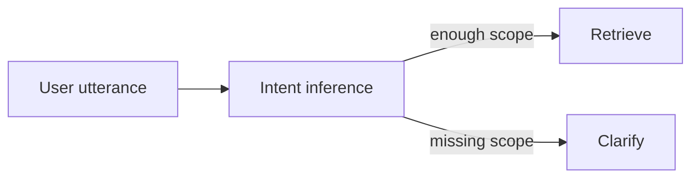

# Chapter 16: Query rewriting, expansion, and decomposition

## Chapter concepts covered

- **Query rewriting and expansion** (implemented in code)
- **Decomposition into subqueries** (partially demonstrated)
- **Ask the user instead of guessing missing scope** (implemented in code)

## What is implemented directly vs documented only

- **Decomposition into subqueries** - partially demonstrated. Subqueries are extracted heuristically; full aggregation logic is modest.

## Code paths

- `raglab/retrieval/engine.py`
- `raglab/agent/controller.py`

## Mermaid diagram



## CLI commands to run

```bash
poetry run raglab agent "What changed in the latest distributor warranty terms for V14?" --workspace .workspace/demo --user-id distributor-eu
```
```bash
poetry run raglab agent "Show me the Phoenix torque update." --workspace .workspace/demo --user-id field-eu
```

## Debugging tips

- Inspect the clarification request and the `missing_scope` / `ambiguous_options` diagnostics.
- Read `infer_intent()` to see how normalization, filters, rewrites, and ambiguity triggers are derived.

## Trace and log outputs to inspect

- Agent traces with `plan_created` and clarification events

## Tests that cover this chapter

- `tests/test_integration.py::AnswerAndAgentTests.test_agent_requests_clarification_for_ambiguous_policy_query`

## What to read first in code

- `raglab/retrieval/engine.py`
- `raglab/agent/controller.py`

## Limitations / simplifications

Query rewriting and ambiguity detection are heuristic rather than learned. The repository favors transparent rules over opaque model-based rewriting.
