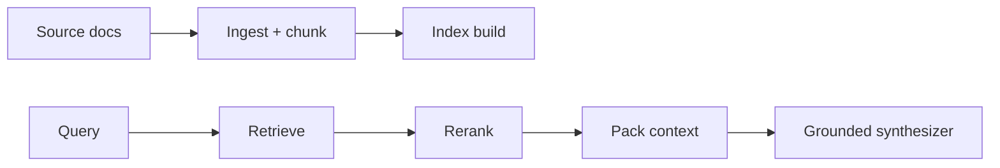

# Chapter 18: Long-context RAG and context compression

## Chapter concepts covered

- **Long-context budgeting** (implemented in code)
- **Extractive compression** (implemented in code)
- **Abstractive compression and lost-in-the-middle analysis** (documented only)

## What is implemented directly vs documented only

- **Abstractive compression and lost-in-the-middle analysis** - documented only. The repository avoids abstractive compression because it would require a more capable model.

## Code paths

- `raglab/ingest/pipeline.py`
- `raglab/build.py`
- `raglab/retrieval/engine.py`
- `raglab/generation/synthesizer.py`
- `raglab/generation/verify.py`

## Mermaid diagram



## CLI commands to run

```bash
poetry run raglab ingest --source examples/corpus/base --source examples/corpus/update --workspace .workspace/demo
```
```bash
poetry run raglab index --workspace .workspace/demo
```
```bash
poetry run raglab publish --workspace .workspace/demo
```
```bash
poetry run raglab answer "Does firmware 3.2 change the V14 installation torque, and where is that stated?" --workspace .workspace/demo --user-id field-eu
```

## Debugging tips

- Inspect `workspace/staged/manifest.json`, `docs.jsonl`, and `chunks.jsonl` after ingest.
- Use `retrieve` before `answer` to see which evidence enters the packed context.
- Use `trace` on the saved trace JSON to inspect retrieve -> rerank -> pack -> synthesize spans.

## Trace and log outputs to inspect

- `workspace/traces/*.json` with `query_understanding`, `first_pass_retrieval`, `rerank`, and `context_pack` spans

## Tests that cover this chapter

- `tests/test_integration.py::AnswerAndAgentTests.test_grounded_answer_includes_supported_claim`
- `tests/test_integration.py::RetrievalTests.test_sparse_retrieval_finds_exact_identifier`

## What to read first in code

- `raglab/ingest/pipeline.py`
- `raglab/retrieval/engine.py`
- `raglab/generation/synthesizer.py`

## Limitations / simplifications

Answer synthesis is extractive and conservative. It is meant to teach evidence flow, not to emulate a frontier generator.
