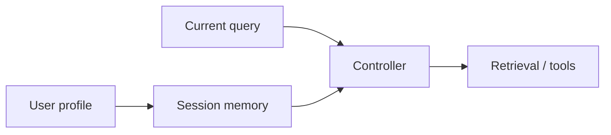

# Chapter 20: Personalization, session memory, and adaptive context

## Chapter concepts covered

- **Session memory and scoped memory writes** (implemented in code)
- **Adaptive retrieval from user profile and session state** (implemented in code)
- **Memory contamination guardrails** (partially demonstrated)

## What is implemented directly vs documented only

- **Memory contamination guardrails** - partially demonstrated. Conflicting product memory is pruned; more advanced contamination control is documented only.

## Code paths

- `raglab/agent/memory.py`
- `raglab/agent/controller.py`
- `raglab/ops/governance.py`

## Mermaid diagram



## CLI commands to run

```bash
poetry run raglab agent "Which EU service centers support V14 sensor replacement under the current warranty program?" --workspace .workspace/demo --user-id distributor-eu --assume region=EU --assume product=V14 --session-id demo-session
```
```bash
poetry run raglab agent "What changed after the recall?" --workspace .workspace/demo --user-id distributor-eu --session-id demo-session
```

## Debugging tips

- Inspect `workspace/sessions/<session-id>.json` after each turn to see what was persisted.
- Read `_apply_session_memory()` and `prune_memory_for_new_scope()` for contamination controls.

## Trace and log outputs to inspect

- Session JSON plus agent traces

## Tests that cover this chapter

- `tests/test_integration.py::AnswerAndAgentTests.test_agent_can_use_structured_tool`

## What to read first in code

- `raglab/agent/memory.py`
- `raglab/agent/controller.py`

## Limitations / simplifications

Session memory is file-backed and intentionally small. It demonstrates scope-aware memory writes and pruning, not large long-term memory systems.
