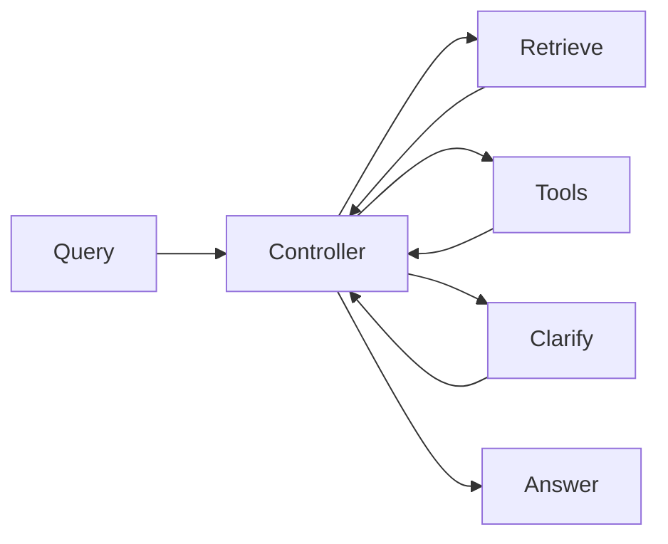

# Chapter 26: Routing across retrievers, tools, and models

## Chapter concepts covered

- **Routing across retrievers** (implemented in code)
- **Routing across structured tools vs text retrieval** (implemented in code)
- **Routing across model families** (partially demonstrated)

## What is implemented directly vs documented only

- **Routing across model families** - partially demonstrated. Fast vs careful synthesis profiles simulate model-family routing without external models.

## Code paths

- `raglab/agent/controller.py`
- `raglab/agent/router.py`
- `raglab/agent/planner.py`
- `raglab/agent/tools.py`
- `raglab/generation/verify.py`

## Mermaid diagram



## CLI commands to run

```bash
poetry run raglab agent "Where is the rollback procedure for X12 staging key rotation documented?" --workspace .workspace/demo --user-id field-eu
```
```bash
poetry run raglab agent "What changed in the latest distributor warranty terms for V14?" --workspace .workspace/demo --user-id distributor-eu
```

## Debugging tips

- Inspect `plan_created` events and action history in the agent trace.
- Compare routes chosen by `choose_route()` against the observed evidence.
- Watch when the controller asks the user, retries retrieval, calls a tool, or escalates.

## Trace and log outputs to inspect

- Agent traces with action history, route choices, and tool spans

## Tests that cover this chapter

- `tests/test_integration.py::AnswerAndAgentTests.test_agent_requests_clarification_for_ambiguous_policy_query`
- `tests/test_integration.py::OpsAndCliTests.test_trace_file_created_for_agent_run`

## What to read first in code

- `raglab/agent/controller.py`
- `raglab/agent/router.py`
- `raglab/agent/planner.py`

## Limitations / simplifications

The controller is bounded and largely rule-driven. It demonstrates stateful action selection without pretending to be a free-form autonomous agent.
