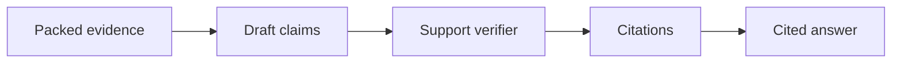

# Chapter 30: Groundedness, attribution, and citation

## Chapter concepts covered

- **Groundedness as claim support** (implemented in code)
- **Attribution with citations** (implemented in code)
- **Post-generation citation verification** (implemented in code)

## What is implemented directly vs documented only

- None. This chapter is represented directly in code.

## Code paths

- `raglab/generation/verify.py`
- `raglab/generation/synthesizer.py`
- `raglab/retrieval/engine.py`

## Mermaid diagram



## CLI commands to run

```bash
poetry run raglab answer "Does firmware 3.2 change the V14 installation torque, and where is that stated?" --workspace .workspace/demo --user-id field-eu
```
```bash
poetry run raglab agent "Write a short answer for a distributor explaining the latest warranty exclusions for V14." --workspace .workspace/demo --user-id distributor-eu --assume region=EU
```

## Debugging tips

- Inspect `Claim` objects and `Citation` objects in JSON output from `answer --json` or `agent --json`.
- Read `support_score()` to see how claim support is computed and why some claims remain unsupported.

## Trace and log outputs to inspect

- Claim objects in JSON output; answer traces show the packed evidence that citations draw from

## Tests that cover this chapter

- `tests/test_integration.py::AnswerAndAgentTests.test_grounded_answer_includes_supported_claim`

## What to read first in code

- `raglab/generation/verify.py`
- `raglab/generation/synthesizer.py`

## Limitations / simplifications

Citation verification uses token and number overlap, not entailment models. It keeps the support contract visible without external dependencies.
