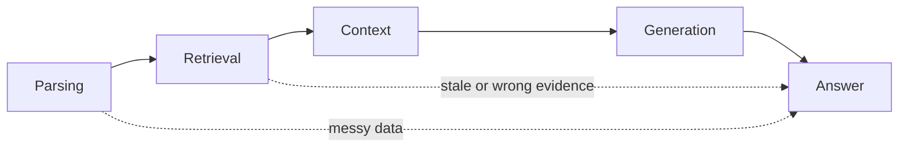

# Chapter 31: Failure modes and hallucination in RAG

## Chapter concepts covered

- **Retrieval-induced vs generation-induced failure taxonomy** (partially demonstrated)
- **Context contamination** (implemented in code)
- **Messy-data failures** (implemented in code)

## What is implemented directly vs documented only

- **Retrieval-induced vs generation-induced failure taxonomy** - partially demonstrated. The code surfaces stale, conflicting, and unsupported-evidence cases; a real generative hallucination model is out of scope.

## Code paths

- `raglab/ingest/pipeline.py`
- `raglab/retrieval/engine.py`
- `raglab/generation/verify.py`
- `raglab/ops/security.py`

## Mermaid diagram



## CLI commands to run

```bash
poetry run raglab demo chapter 31 --workspace .workspace/demo --run
```
```bash
poetry run raglab demo prepare --workspace .workspace/fresh-base --base-only
```
```bash
poetry run raglab answer "Does firmware 3.2 change the V14 installation torque, and where is that stated?" --workspace .workspace/fresh-base --user-id field-eu
```

## Debugging tips

- Use a base-only snapshot to surface stale-evidence behavior.
- Inspect quarantined OCR and malicious documents to see how upstream failure classes are represented.
- Check unsupported claims in answer JSON for generation-stage issues.

## Trace and log outputs to inspect

- Compare traces between stale and updated snapshots, plus unsupported claim flags

## Tests that cover this chapter

- `tests/test_integration.py::IngestionTests.test_quarantine_contains_malicious_and_low_quality_docs`
- `tests/test_integration.py::AnswerAndAgentTests.test_agent_requests_clarification_for_ambiguous_policy_query`

## What to read first in code

- `raglab/ingest/pipeline.py`
- `raglab/generation/verify.py`
- `raglab/retrieval/engine.py`

## Limitations / simplifications

Hallucination is approximated through unsupported claims and stale/conflicting evidence. There is no free-running LLM hallucination model in this repository.
