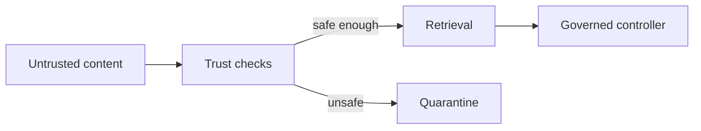

# Chapter 32: Security threats: prompt injection, retrieval poisoning, and data leakage

## Chapter concepts covered

- **Indirect prompt injection detection** (partially demonstrated)
- **Trust-aware ingestion and retrieval** (implemented in code)
- **Permission-aware least-privilege tool use** (implemented in code)

## What is implemented directly vs documented only

- **Indirect prompt injection detection** - partially demonstrated. Heuristics flag instruction-like text in retrieved documents.

## Code paths

- `raglab/ops/security.py`
- `raglab/ingest/pipeline.py`
- `raglab/ops/governance.py`
- `raglab/agent/tools.py`

## Mermaid diagram



## CLI commands to run

```bash
poetry run raglab ingest --source examples/corpus/base --source examples/corpus/update --workspace .workspace/demo
```
```bash
python - <<'PY'
from pathlib import Path
print((Path('.workspace/demo')/'staged'/'quarantine.jsonl').read_text())
PY
```
```bash
poetry run raglab demo chapter 32 --workspace .workspace/demo --run
```

## Debugging tips

- Inspect quarantined documents for injection-like phrases and low trust scores.
- Read `ToolRuntime.validate()` and `allow_action()` to see how tool-side controls complement retrieval-side controls.

## Trace and log outputs to inspect

- Quarantine file plus agent traces when tools are invoked

## Tests that cover this chapter

- `tests/test_integration.py::IngestionTests.test_quarantine_contains_malicious_and_low_quality_docs`

## What to read first in code

- `raglab/ops/security.py`
- `raglab/agent/tools.py`
- `raglab/ops/governance.py`

## Limitations / simplifications

Security defenses are heuristic and illustrative. They show control points, not production-grade red-teaming or content sandboxing.
