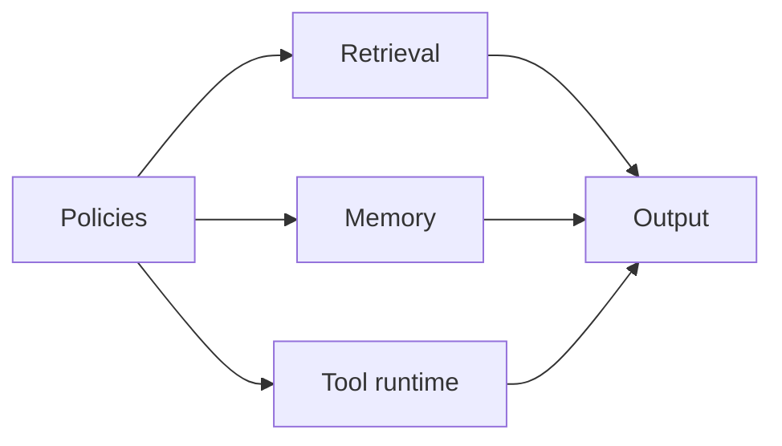

# Chapter 36: Governance, privacy, and compliance

## Chapter concepts covered

- **Role-based access and disclosure classes** (implemented in code)
- **Retention and auditability hooks** (partially demonstrated)
- **Purpose limitation and human approval gates** (partially demonstrated)

## What is implemented directly vs documented only

- **Retention and auditability hooks** - partially demonstrated. Retention tags and auditable traces exist, but no external deletion workflow is integrated.
- **Purpose limitation and human approval gates** - partially demonstrated. Action approval is a toy predicate rather than a full enterprise policy engine.

## Code paths

- `raglab/ops/governance.py`
- `raglab/agent/controller.py`
- `raglab/agent/tools.py`
- `examples/users.json`

## Mermaid diagram



## CLI commands to run

```bash
poetry run raglab answer "Write a short answer for a distributor explaining the latest warranty exclusions for V14." --workspace .workspace/demo --user-id distributor-eu
```
```bash
poetry run raglab answer "Write a short answer for a distributor explaining the latest warranty exclusions for V14." --workspace .workspace/demo --user-id compliance-analyst
```

## Debugging tips

- Compare behavior across `distributor-eu`, `field-eu`, and `compliance-analyst` profiles.
- Inspect `allow_action()` and `can_view()` for the policy gate points.

## Trace and log outputs to inspect

- Compare traces across user roles and inspect retained trace metadata

## Tests that cover this chapter

- `tests/test_integration.py::AnswerAndAgentTests.test_agent_requests_clarification_for_ambiguous_policy_query`

## What to read first in code

- `raglab/ops/governance.py`
- `examples/users.json`
- `raglab/agent/tools.py`

## Limitations / simplifications

Governance is intentionally compact: role-based disclosure filters, retention tags, and a toy action-allow predicate. It demonstrates how policy constrains code paths.
