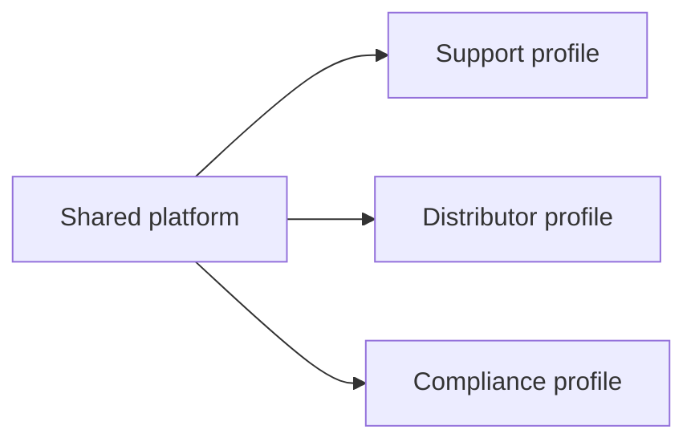

# Chapter 37: Enterprise knowledge assistants and domain agents

## Chapter concepts covered

- **Domain grounding by role and workflow** (implemented in code)
- **Workflow integration** (partially demonstrated)
- **Domain-specific evaluation and source preference** (partially demonstrated)

## What is implemented directly vs documented only

- **Workflow integration** - partially demonstrated. Structured service-center and runbook tools simulate domain-specific integrations.
- **Domain-specific evaluation and source preference** - partially demonstrated. Domain demos and role-aware behavior exist; real business KPIs are documented only.

## Code paths

- `raglab/agent/router.py`
- `raglab/agent/controller.py`
- `raglab/ops/governance.py`
- `examples/users.json`

## Mermaid diagram



## CLI commands to run

```bash
poetry run raglab agent "Where is the rollback procedure for X12 staging key rotation documented?" --workspace .workspace/demo --user-id field-eu
```
```bash
poetry run raglab agent "Write a short answer for a distributor explaining the latest warranty exclusions for V14." --workspace .workspace/demo --user-id distributor-eu --assume region=EU
```

## Debugging tips

- Compare route and disclosure behavior between support and distributor profiles.
- Inspect examples/users.json and router rules to see how domain grounding changes behavior.

## Trace and log outputs to inspect

- Compare traces across roles to see different route and evidence choices

## Tests that cover this chapter

- `tests/test_integration.py::AnswerAndAgentTests.test_agent_can_use_structured_tool`
- `tests/test_integration.py::AnswerAndAgentTests.test_agent_requests_clarification_for_ambiguous_policy_query`

## What to read first in code

- `examples/users.json`
- `raglab/agent/router.py`
- `raglab/agent/controller.py`

## Limitations / simplifications

Domain specialization is done with explicit policies and example corpora, not fine-tuned models or external enterprise systems.
